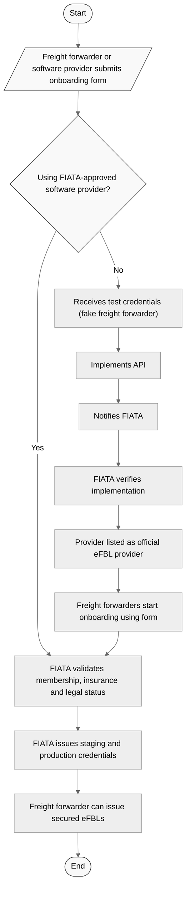

# Joining the FIATA Digital Bill of Lading Ecosystem
#### Integration Guide for Software Providers and Independent TMS Developers

## 🚀 Getting Started with the FIATA Digital Bill of Lading (eFBL)

Welcome to the onboarding guide for the FIATA Digital Bill of Lading (eFBL) — a secure, trusted, and interoperable solution for issuing digital FBLs.

Whether you work with an integrated software provider or are developing your own Transport Management System (TMS), this guide will help you join the FIATA digital ecosystem in the most efficient way.

There are **two onboarding pathways**, depending on your setup:

- ✅ **Path 1: Connect Through a FIATA-Approved Software Provider**  
  Ideal for freight forwarders already using a TMS that has integrated FIATA’s Paperless FBL Service. The process is fast and requires minimal technical effort on your side.

- 🛠️ **Path 2: Integrate the FIATA eFBL API into Your Own System**  
  Designed for freight forwarders building their own TMS or digital solution. This path gives you full access to the FIATA API and cryptographic infrastructure.

Each section of this guide will walk you through the appropriate steps based on your profile. Let's get started.

## ✅ Path 1: Connect Through a FIATA-Approved Software Provider
If you already use a digital tool or Transport Management System (TMS) that is officially integrated with the FIATA eFBL infrastructure, your onboarding process is simple and fast.

FIATA collaborates with a growing network of software providers that have implemented the secure **Paperless FBL Service**. These providers offer seamless access to generate, sign, and manage digital FBLs, directly from their platforms — no need for separate technical integration on your side.

Fill out this form to initiate the process:  
   👉 [Onboarding Form](https://1z932gem9zm.typeform.com/to/OIMuxKl7?typeform-source=www.efbl.fiata.org)

---

#### 🧭 Steps to Get Started

1. **Check if Your Software Provider is Connected**
   - Confirm with your current TMS or software vendor whether they support FIATA’s Paperless FBL Service.
   - Alternatively, refer to the [official list of connected providers](https://fiata.org/digital-bill-of-lading/) or contact FIATA support.

2. **Request Access via Your Provider**
   - If your provider is integrated, they will trigger the onboarding request on your behalf via the FIATA onboarding API.
   - You do **not** need to contact FIATA directly or manage any credentials yourself at this stage.

3. **Wait for FIATA Validation**
   - FIATA will verify your company details (e.g., active membership and legal status) before activating your eFBL account.
   - Once validated, you will be issued a **unique digital signature certificate** linked to your company, enabling you to issue authenticated digital FBLs.

4. **Start Issuing eFBLs**
   - Once activated, your software provider will allow you to create, sign, and share eFBLs directly within their platform.
   - Your company name will also appear in the public [Registry of Trusted Issuers](https://fiata.org/digital-bill-of-lading/).

---

#### 🛠️ Technical Notes

Your provider handles all API communication, authentication, and secure key storage. You do **not** need to manage API tokens, sign certificates, or implement any cryptographic protocol.

> If your provider is not yet integrated, you may want to contact them to express interest or consider using a FIATA-verified platform.

### 🛠️ Path 2: Integrate the FIATA eFBL API into Your Own System

If you're developing your own Transport Management System (TMS) or shipping software, you can implement the FIATA Paperless FBL Service directly. This allows your system to generate, sign, and transmit secured digital FIATA Bills of Lading (eFBLs) according to FIATA standards.

FIATA provides:
- A **free and open eFBL data standard**, aligned with the UN/CEFACT MMT Reference Data Model for full interoperability across the supply chain.
- A **dedicated API** for secure communication and digital signature generation.
- Technical documentation and a Python-based [demo implementation](https://github.com/FIATA/eFBL-demo-implementation/) to guide your development.

---

#### 📘 Technical Resources

- **[Data Model Documentation](https://fiata.github.io/eFBL/schema_doc.html)**  
  Describes the JSON schema for the FIATA eFBL, aligned with international data standards.

- **[API Usage Guide](https://github.com/FIATA/eFBL/blob/main/docs/PAPERLESS_FBL_SERVICE_USAGE.md)**  
  Explains how to interact with the Paperless FBL Service, including endpoints, authentication, signing flow, and issuer validation.

- **[Demo Python Implementation](https://github.com/FIATA/eFBL-demo-implementation/)**  
  A working prototype using the API — ideal for understanding how to structure your implementation.

---

#### 🧭 Steps to Connect Your System

1. **Register Your Interest**  
   Fill out this form to initiate the process:  
   👉 [Onboarding Form](https://1z932gem9zm.typeform.com/to/OIMuxKl7?typeform-source=www.efbl.fiata.org)

2. **Receive Sandbox Credentials**  
   FIATA will provide you with API credentials for a test freight forwarder on our **staging environment**.

3. **Develop and Test Your Integration**  
   Use the API documentation and sandbox access to build and test your integration. You’ll be able to issue test eFBLs during this phase.

4. **Submit for Verification**  
   Once your system can successfully issue and sign a digital FBL, notify FIATA so we can verify your implementation.

5. **Become a Certified Software Provider**  
   Upon approval, your software will be listed on the FIATA website as an **official eFBL provider**.

6. **Let Freight Forwarders Onboard via Your Tool**  
   Any freight forwarder wishing to use your software for eFBLs must register through the same [FIATA onboarding form](https://1z932gem9zm.typeform.com/to/OIMuxKl7).  
   Their request will be validated based on criteria such as:
   - FIATA membership
   - Insurance coverage
   - Legal entity verification  
   Once validated, they will receive **both staging and production credentials** for issuing digital FBLs.

